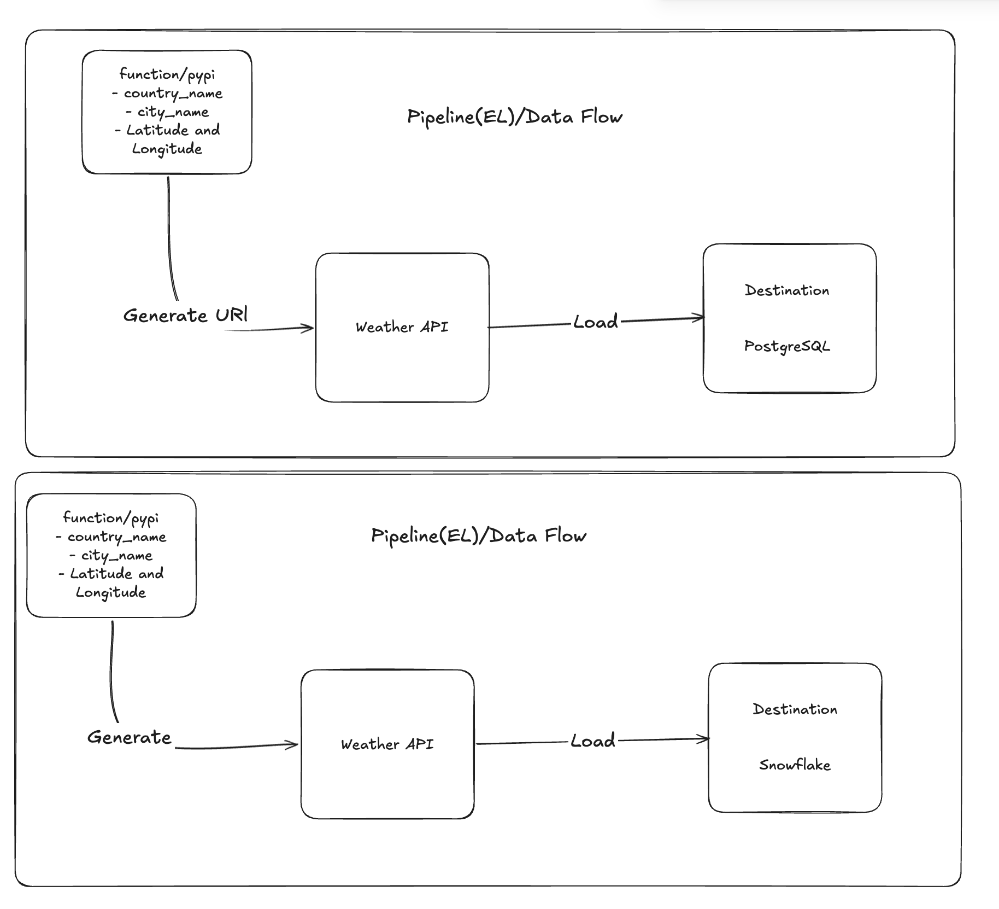

# ETL Weather Data Pipeline

## Project Title

**ETL Weather Data Pipeline** - Two independent Python ETL pipelines that fetch weather data and load it into PostgreSQL and Snowflake

---

## Project Overview

This project contains two separate ETL pipelines - one that loads weather data into PostgreSQL and another that loads weather data into Snowflake. Both pipelines fetch city and country data using the countrystatecity-countries library, generate API endpoints using latitude and longitude coordinates, call the OpenWeatherMap API to retrieve weather data, transform the data, and load it into their respective database destinations.

---

## Project Architecture / Data Flow

**Pipeline 1 - PostgreSQL:**
Extract city data → Load to PostgreSQL → Query coordinates from PostgreSQL → Generate API URLs → Fetch weather data via API → Transform data → Load to PostgreSQL

**Pipeline 2 - Snowflake:**
Extract city data → Load to Snowflake → Query coordinates from Snowflake → Generate API URLs → Fetch weather data via API → Transform data → Load to Snowflake

---

## Technology Stack

| Component | Technology |
|-----------|-----------|
| **Language** | Python 3.12+ |
| **Package Manager** | UV |
| **Data Processing** | Pandas |
| **Database Connection (PostgreSQL)** | SQLAlchemy, psycopg2 |
| **Database Connection (Snowflake)** | snowflake-connector-python |
| **Code Organization** | Python Dataclasses |
| **Environment Variables** | python-dotenv |
| **HTTP Requests** | Requests |
| **Concurrency** | ThreadPoolExecutor |
| **Cities Data** | countrystatecity-countries library |

---

## Source Data

**Data Source:** OpenWeatherMap API using coordinates

**Data Extraction Process:**
- Uses countrystatecity-countries library to get all countries
- Uses countrystatecity-countries library to get all cities for each country (with latitude and longitude)
- Generates OpenWeatherMap API URLs using latitude and longitude coordinates
- Fetches real-time weather data from API endpoints

**API Response Data:** The pipeline receives weather data in JSON format from the OpenWeatherMap API

---

## Data Transformation

**Transformation Steps:**

1. **Hash Generation:** Creates a SHA-256 hash from the ID and coordinates to create a unique key for each record
2. **Data Type Handling:** Converts complex data types (dictionaries, lists) to JSON strings
3. **Null Initialization:** Adds rain and snow columns with null values
4. **Column Standardization:** Converts column names to uppercase (for Snowflake)
5. **Timestamp Addition:** Adds a timestamp for when the record was created
6. **Sorting:** Sorts data by timestamp
7. **Deduplication:** Removes duplicate records based on unique_key, keeping only the latest record

---

## PostgreSQL Destination

**Connection Details:**
- Uses SQLAlchemy with psycopg2 adapter
- Loads environment variables using python-dotenv
- Database credentials from .env file: POSTGRES_USER, POSTGRES_PASSWORD

**Data Loading Strategy:**
- Checks if weather_data table exists
- If table exists: loads new data to temp_table, then uses SQL MERGE to update existing records or insert new records
- If table doesn't exist: creates weather_data table and loads data directly
- Deletes temp_table after merge operation completes

**Database Operations:**
- PostgresConnection class creates database connection
- PostgresOperation class checks if tables exist and deletes tables
- PostgresDestination class loads data to PostgreSQL tables
- PostgresSource class queries data from PostgreSQL

---

## Snowflake Destination

**Connection Details:**
- Uses snowflake-connector-python with pandas integration
- Loads environment variables using python-dotenv
- Database credentials from .env file: SNOWFLAKE_USER, SNOWFLAKE_PASSWORD, SNOWFLAKE_ACCOUNT, SNOWFLAKE_WAREHOUSE

**Data Loading Strategy:**
- Auto-creates tables if they don't exist (auto_create_table=True)
- Appends new data without overwriting existing data (overwrite=False)
- Uses write_pandas function from snowflake-connector-python for efficient data transfer

**Database Operations:**
- SnowflakeConnection class creates database connection
- SnowflakeDestination class loads data into Snowflake tables
- SnowflakeOperation class queries data from Snowflake

---

## Prerequisites

**Python Version:** 3.12 or higher

**Required Environment Variables in .env file:**
- POSTGRES_USER (for PostgreSQL pipeline)
- POSTGRES_PASSWORD (for PostgreSQL pipeline)
- SNOWFLAKE_USER (for Snowflake pipeline)
- SNOWFLAKE_PASSWORD (for Snowflake pipeline)
- SNOWFLAKE_ACCOUNT (for Snowflake pipeline)
- SNOWFLAKE_WAREHOUSE (for Snowflake pipeline)

**External Credentials:**
- PostgreSQL database with network access
- Snowflake account with network access
- OpenWeatherMap API access

---

## Installation & Setup

**Step 1: Set up dependencies**
Use UV package manager to install dependencies from pyproject.toml

**Step 2: Create .env file**
Create a .env file in the project root with your database and API credentials

**Step 3: Load environment variables**
The code uses `from dotenv import load_dotenv` to load credentials from .env file at runtime

---
## What I Learned
- Data Engineering Concepts - ETL vs ELT paradigm, deduplication, incremental loading.

- Database Technologies - PostgreSQL and Snowflake specifics.

- Python Development - Dataclasses, concurrency, environment variables, error handling.

- External Libraries - pandas, requests, ThreadPoolExecutor, etc.

- API Integration - Endpoint generation, batch processing, concurrent requests

## What I will DO With More Time

- Improve Error Handling & Reliability - Logging, retries, notifications

- Data Quality & Monitoring - Validation, metrics, anomaly detection

- Orchestration & Scheduling - Apache Airflow, scheduling

- Containerization & Deployment - Docker, cloud deployment, CI/CD

## Contact

**Feel free to reach me if have any question**

- [LinkIn](https://www.linkedin.com/in/ujjwol-k-c-37519329b/)

- **Email** : kcujjwol1999@gmail.com

